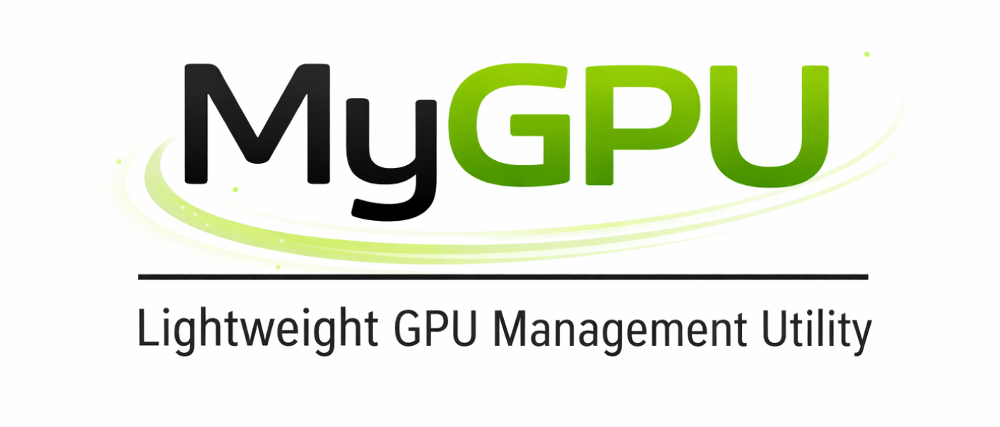

<div align="center">
  <a href="../README.md">🇺🇸 영어</a> |
  <a href="README.de.md">🇩🇪 독일어</a> |
  <a href="README.fr.md">🇫🇷 프랑스어</a> |
  <a href="README.es.md">🇪🇸 스페인어</a> |
  <a href="README.ja.md">🇯🇵 일본어</a> |
  <a href="README.zh.md">🇨🇳 중국어</a> |
  <a href="README.pt.md">🇵🇹 포르투갈어</a> |
  <a href="README.ko.md">🇰🇷 한국어</a>
</div>

<div style="text-align:center; margin:18px 0;">
  
</div>

> *MyGPU: 가벼운 GPU 관리 유틸리티: NVIDIA nvidia-smi의 간결한 랩핑과 깨끗한 웹 대시보드가 포함된 컴팩트한 GPU 관리 도구.*


## 갤러리

<details>
  <summary>웹 대시보드</summary>
  <div style="display:flex; overflow-x:auto; gap:10px; padding:12px 0; scroll-snap-type:x mandatory; -webkit-overflow-scrolling:touch;">
    <!-- 첫 번째 이미지를 1624x675 비율로 사용하여 슬라이드 프레임으로 설정하고, 다른 이미지들은 'object-fit: contain'을 사용하여 안에 맞춥니다. -->
    <div style="flex:0 0 100%; scroll-snap-align:center; aspect-ratio:1624/675; display:flex; align-items:center; justify-content:center;">
      
    </div>
    <div style="flex:0 0 100%; scroll-snap-align:center; aspect-ratio:1624/675; display:flex; align-items:center; justify-content:center;">
      
    </div>
    <div style="flex:0 0 100%; scroll-snap-align:center; aspect-ratio:1624/675; display:flex; align-items:center; justify-content:center;">
      
    </div>
    <div style="flex:0 0 100%; scroll-snap-align:center; aspect-ratio:1624/675; display:flex; align-items:center; justify-content:center;">
      
    </div>
  </div>
</details>
<details>
  <summary>CLI</summary>
  <div style="display:flex; overflow-x:auto; gap:10px; padding:12px 0; scroll-snap-type:x mandatory; -webkit-overflow-scrolling:touch;">
    <div style="flex:0 0 100%; scroll-snap-align:center; aspect-ratio:1624/675; display:flex; align-items:center; justify-content:center;">
      
    </div>
    <!-- 추가 이미지들... -->
  </div>
</details>

### 이 도구를 사용하는 이유

- **가볍다**: 최소한의 리소스 사용.
- **유연하다**: CLI 도구, 또는 완전한 웹 대시보드 형태로 제공.
- **관리자 중심**: **VRAM 강제 제한** (VRAM 사용량 제한 자동 종료) 및 **감시 목록**과 같은 기능이 포함되어 있다.
- **개발자 친화적**: GEMM, 입자 물리학 시뮬레이션과 같은 벤치마크 및 스트레스 테스트 도구를 내장하여 시스템 안정성을 검증할 수 있다.

---

## 기능

- **실시간 모니터링**:
  - GPU 메트릭(사용률, VRAM, 전력, 온도) 및 시스템 메트릭(CPU, RAM 등) 제공.
- **관리자 및 강제 제한**:
  - **VRAM 제한**: GPU당 VRAM 사용량에 대한 하드 제한 설정.
  - **자동 종료**: VRAM 정책을 위반하는 프로세스를 자동 종료 (관리자 전용).
  - **감시 목록**: 특정 PID 또는 프로세스 이름을 모니터링.
- **벤치마크 및 시뮬레이션**:
  - **스트레스 테스트**: GEMM 워크로드를 사용하여 열 스로틀링 및 안정성을 테스트.
  - **입자 물리학 시뮬레이션**: GPU 부하를 시각화하기 위한 상호형 3D 입자 물리학 시뮬레이션.

---

## 로드맵 및 미래 작업

기여 환영! 향후 주요 포인트는 다음과 같다:

- **다중 GPU 지원**: NVLink 토폴로지를 포함한 다중 카드 설정 향상.
- **컨테이너화**: Docker 공식 지원을 통해 컨테이너 환경에서 쉽게 배포.
- **원격 액세스**: SSH 터널링 통합 및 안전한 원격 관리.
- **플랫폼 확장**:
  - [ ] Linux 지원 (Ubuntu/Debian 집중).
  - [ ] Apple Silicon을 위한 macOS 지원.
- **하드웨어 무관성**:
  - [ ] AMD ROCm 지원.
  - [ ] Intel Arc 지원.
- [ ] 다국어 문서화 (GitHub에서 인기 있는 언어 우선).

[CONTRIBUTING.md](../CONTRIBUTING.md)를 참조하세요.

---

## 요구 사항

- **OS**: Windows 10/11
- **Python**: 3.10+
- **하드웨어**: NVIDIA GPU 및 설치 드라이버.
- **CUDA**: 12.x (벤치마크/시뮬레이션 기능 사용 시 필수).
  - *참고: CUDA 12.x가 감지되지 않으면, 해당 기능은 비활성화됩니다.*

---

## 설치

도구는 모듈식 설치를 지원하여 사용자의 요구에 맞게 설치할 수 있습니다.

### 1. 최소 (CLI만)

서버나 백그라운드 모니터링에 적합한 CLI 전용 설치.

### 2. 표준 (CLI + 웹 UI)

대부분의 사용자에게 적합.

- 웹 대시보드 포함.
- REST API 엔드포인트.
- 실시간 차트.

### 3. 풀 (표준 + 시각화)

개발 및 스트레스 테스트에 적합.

- 입자 물리학 시뮬레이션 포함.
- PyTorch/CuPy 의존성 (벤치마크를 위해).

### 빠른 시작

1. **최신 버전 다운로드 또는 저장소 복제.**
2. **설정 스크립트 실행:**

  ```powershell
  .\setup.ps1
  ```

3. **실행:**

```powershell
# 웹 대시보드 시작 (표준/풀)
python health_monitor.py web

# CLI 시작
python health_monitor.py cli
```